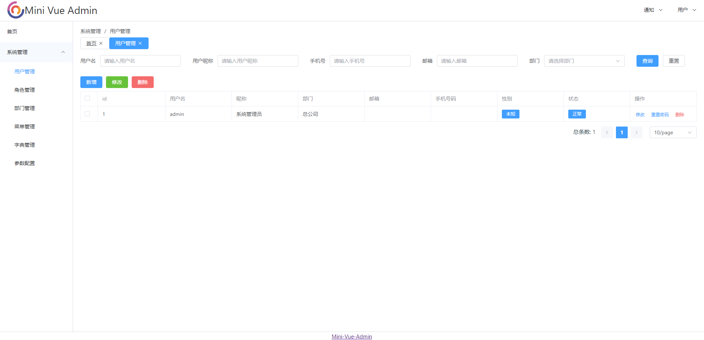
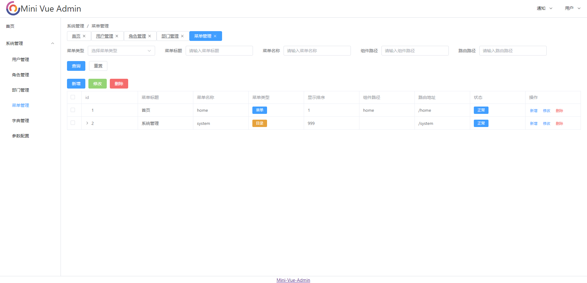

# Mini Vue Admin 

<div style="text-align: center">

</div>

坚持**Less is More**，一个基于Vue + Element Plus的模板框架，采用JS开发，精简的依赖和组件，适合新手入门，也适合高手拓展

特点：

- 使用最新版本的
    - Vue 3.4.x
    - Vite 5.0.x
    - Element Plus 2.6.x
    - Pinia 2.1.x
    - Vue Router 4.2.x
- 精简的项目依赖
    - 除了上面核心依赖项，额外的依赖只有4个
- 基于JS开发，而不是TS
    - 使用ts开发的项目讲真只能增加复杂度，对于管理后台的项目来说并不能增加开发效率
- 没有添加各种编译插件，例如：lint、git、auto import等
    - 这些插件的复杂度经常导致入门项目编译失败，如果认真使用IDE的自动导包、代码提示，一般就能解决任何问题
- 没有复杂的自定义Component组件
    - 经常看到其他的vue后台项目，
      每个项目中包含的自定义组件就超级多，学习成本和使用成本也很高，其实element-plus中的组件已经够用，需要拓展的话可以基于此项目开发新的组件

## 项目文档

这个项目基本上需要介绍的内容不多，我就写一些常见的实现原理，适合入门学习，例如侧边栏菜单、标签栏、form inline修复等

[实现原理](docs/实现原理.md)

很多前端后台项目没有接口文档，导致适配开发非常困难，需要开发人员自己不断阅读代码，总结数据结构，所以这里给出一份接口文档，方便开发者适配后端开发

- [Markdown 接口文档](docs/接口文档.md)
- [Apifox 接口文档](https://uke7m4ybeu.apifox.cn/)

## 初始化项目

```sh
pnpm install
```

### 编译和进入开发模式

```sh
pnpm dev
```

### 编译生产版本

```sh
pnpm build
```

## 项目截图








## 联系和赞助

您的慷慨赞助将直接用于项目的开发、维护和推广，以及支持我的持续努力。

<div style="display: flex; justify-content: center;">
  
  <div style="width: 40px;"></div>
  
</div>